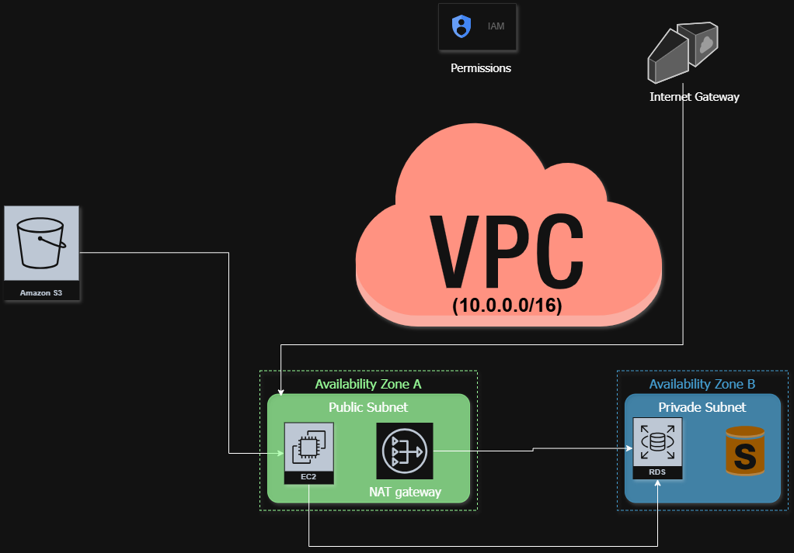

# GeoAI Cloud Architecture: Pipeline de Processamento Geoespacial na AWS

## 📌 Sobre o Projeto
Este projeto apresenta uma arquitetura de nuvem robusta e escalável desenvolvida para a ingestão, processamento e armazenamento de dados geoespaciais (GeoAI) utilizando os serviços da **Amazon Web Services (AWS)**. O objetivo é demonstrar o domínio dos fundamentos de Cloud Computing, aplicando boas práticas de segurança, alta disponibilidade e isolamento de rede.

A arquitetura foi desenhada para suportar fluxos de trabalho como monitoramento ambiental, análise de imagens de satélite e inteligência geográfica, unindo meu background em **Sistemas de Informação** e experiência no setor público com tecnologias de ponta em Nuvem.

---

## 🏗️ Diagrama da Arquitetura

*Diagrama desenvolvido no Diagrams.net seguindo os padrões oficiais da AWS.*

---

## 🛠️ Componentes e Definições (O "Porquê" Técnico)

### 1. Ingestão e Armazenamento (Data Lake)
* **Amazon S3**: Utilizado como o ponto de entrada para imagens de satélite brutos e arquivos vetoriais (GeoJSON, Shapefiles) devido à sua alta durabilidade e baixo custo.

### 2. Processamento (Engine de GeoAI)
* **Amazon EC2 (Image Processor)**: Instância localizada em uma **Public Subnet** para permitir o download de dados externos. Aqui rodam scripts Python (bibliotecas como Rasterio, Geopandas e GDAL) para processamento e análise.

### 3. Persistência de Dados (Geospatial Database)
* **Amazon RDS (PostgreSQL/PostGIS)**: Banco de dados gerenciado localizado em uma **Private Subnet**. O uso do PostGIS permite consultas espaciais complexas e armazenamento seguro dos dados processados.

---

## 🔒 Segurança e Governança (Fundamentos aplicados)

* **VPC & Subnetting**: Implementação de uma VPC com isolamento total entre camadas públicas e privadas.
* **Alta Disponibilidade**: Distribuição dos recursos em múltiplas **Availability Zones (AZs)** para garantir a resiliência do sistema.
* **NAT Gateway**: Configurado para permitir que o banco de dados (privado) realize atualizações de segurança sem expor um IP público para a internet.
* **IAM (Identity and Access Management)**: Aplicação do princípio de privilégio mínimo para controle de acesso entre os serviços.

---

## 👤 Autora
**Maria Eduarda Rodrigues** - Analista de Dados | Geoprocessamento & Modelagem de Dados.
www.linkedin.com/in/maducr